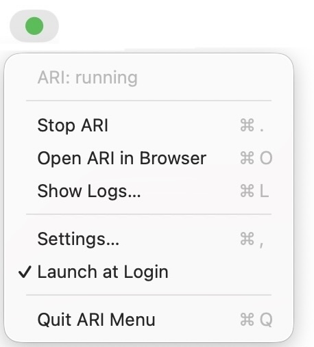

# ARI Menu

A native macOS menu bar app for starting, stopping, and monitoring [ARI](https://github.com/ARIsoftware/ARI) — the open-source personal ops platform.

Lives in your menu bar. One click to start ARI, one click to stop it, and a live status indicator so you always know whether your local stack is up.

<p align="center">
  
</p>

---

## Features

- **Start / Stop** — wraps `./ari start` and `./ari stop` from the ARI CLI
- **Live status indicator** — colored menu bar icon reflects whether the dev server is reachable (polls every 5 seconds by default)
- **Open ARI in browser** — one click opens `http://localhost:3000`
- **Live logs window** — tail dev server output in a SwiftUI window with copy and clear
- **Launch at login** — toggle from the menu, uses the modern `SMAppService` API (no LaunchAgent plists)
- **No Dock icon** — `LSUIElement` enabled; the app lives exclusively in the menu bar

The compiled `.app` bundle is around 400 KB and consumes negligible memory.

## Requirements

- macOS 13 (Ventura) or later
- Swift 5.9+ toolchain (ships with Xcode 15 or the standalone Command Line Tools — `xcode-select --install`)
- A working [ARI](https://github.com/ARIsoftware/ARI) checkout somewhere on disk (default location: `~/ARI`)

## Install

Run these one at a time:

1. Clone the repo:

   ```bash
   git clone https://github.com/ARIsoftware/ARI-MENU.git
   ```

2. Move into the project folder:

   ```bash
   cd ARI-MENU
   ```

3. Build the app:

   ```bash
   bash Scripts/build-app.sh
   ```

4. Move it into your Applications folder:

   ```bash
   mv ARIMenu.app /Applications/
   ```

5. Launch it:

   ```bash
   open /Applications/ARIMenu.app
   ```

Look for the circle icon on the right side of your menu bar. That's it.

> **No Gatekeeper warnings.** Because you compiled the app locally, macOS doesn't apply the quarantine flag it puts on downloaded files. The app launches with no scary "could not verify" dialog — one of the reasons we ship source instead of a prebuilt binary.

> **App Management permission.** On first launch, macOS will prompt you to allow ARI Menu to manage other apps. This is required because **Stop** sends `SIGTERM` to the dev server process (which macOS treats as a different app). Click **Allow**. You can review the permission later under System Settings → Privacy & Security → App Management.

## Configuration

Open the menu and choose **Settings…** to configure:

| Setting | Default | Notes |
|---|---|---|
| ARI repository path | `~/ARI` | The folder containing the `ari` CLI shim. Use the Browse button to pick another location. |
| Status poll interval | 5 seconds | How often the app probes `localhost:3000` to detect whether ARI is running. 2–30 seconds. |
| Launch at login | On | Registers the app as a login item via `SMAppService`. |

Settings are stored in standard `UserDefaults` under the bundle identifier `ari.software.menu`.

## How it works

ARI Menu is a thin SwiftUI shell over the existing `ari` CLI. It does not reimplement any ARI functionality — every action shells out to the CLI you already have:

- **Start** — spawns `/bin/zsh -lc 'cd <ARI_PATH> && ./ari start --verbose'`, streaming stdout and stderr to `~/Library/Logs/ARIMenu/ari.log`.
- **Stop** — sends `SIGTERM` to any process owning port 3000 (handles both menu-app-spawned and externally-launched dev servers), then runs `./ari stop` to tear down Supabase or Postgres as configured.
- **Status** — opens a TCP connection to `localhost:3000` (tries both IPv4 and IPv6, since `pnpm dev -H localhost` binds IPv6-only on macOS).
- **Logs** — tails the log file using `DispatchSource.makeFileSystemObjectSource` for live updates.
- **Launch at login** — uses `SMAppService.mainApp.register()`, the Apple-recommended API as of macOS 13.

The full source is in `Sources/ARIMenu/` — nine small Swift files, roughly 800 lines total.

## Repository layout

```
ARI-MENU/
├── Package.swift              # SwiftPM executable target (macOS 13+)
├── Sources/ARIMenu/           # Application source (~800 lines across 9 files)
├── Scripts/build-app.sh       # Compiles and assembles ARIMenu.app
├── LICENSE                    # Apache 2.0
└── README.md
```

## License

[Apache License 2.0](LICENSE). See the LICENSE file for the full text.

## Related

- [ARI](https://github.com/ARIsoftware/ARI) — the upstream personal ops platform this menu app controls.
